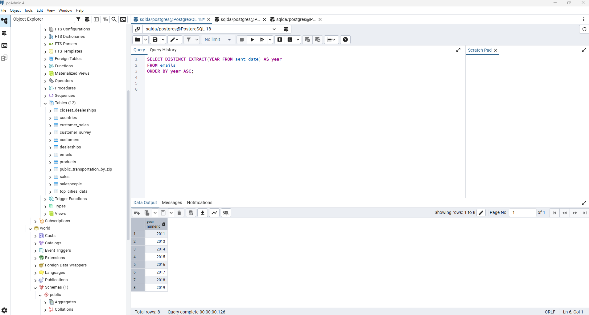
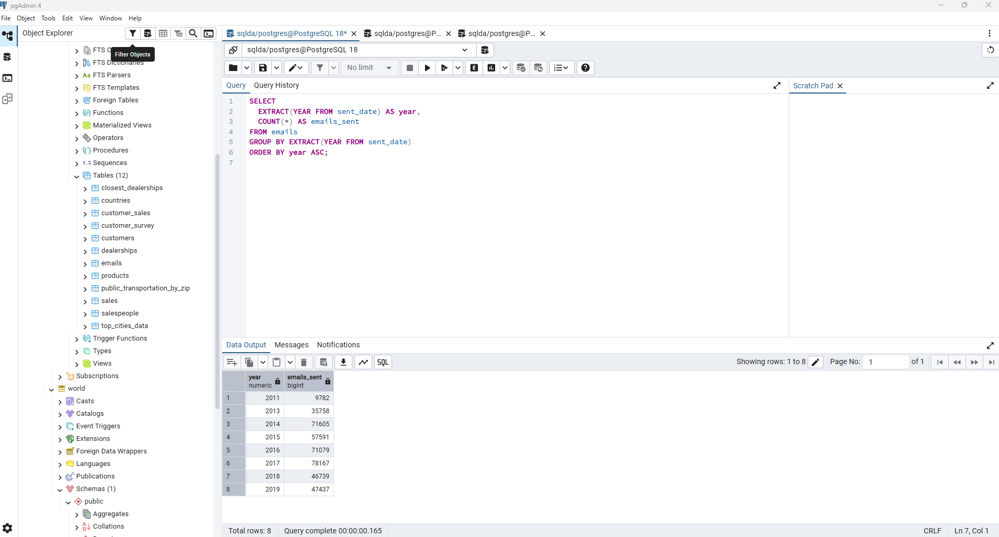
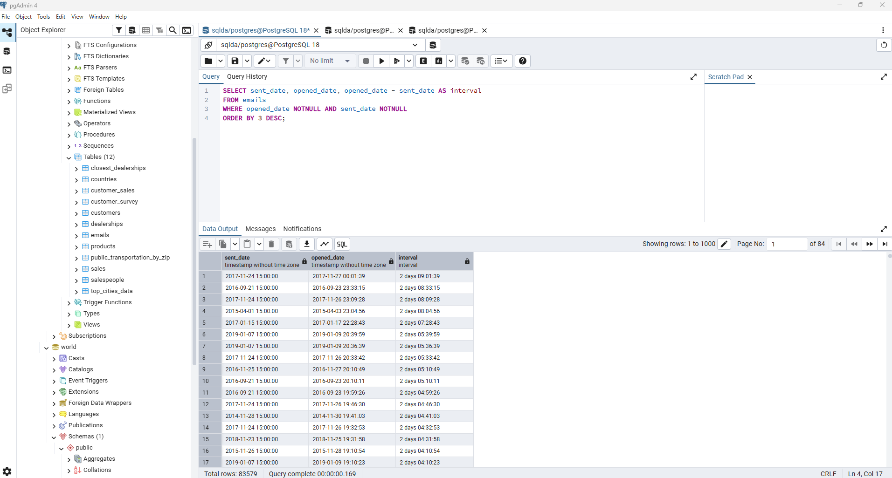
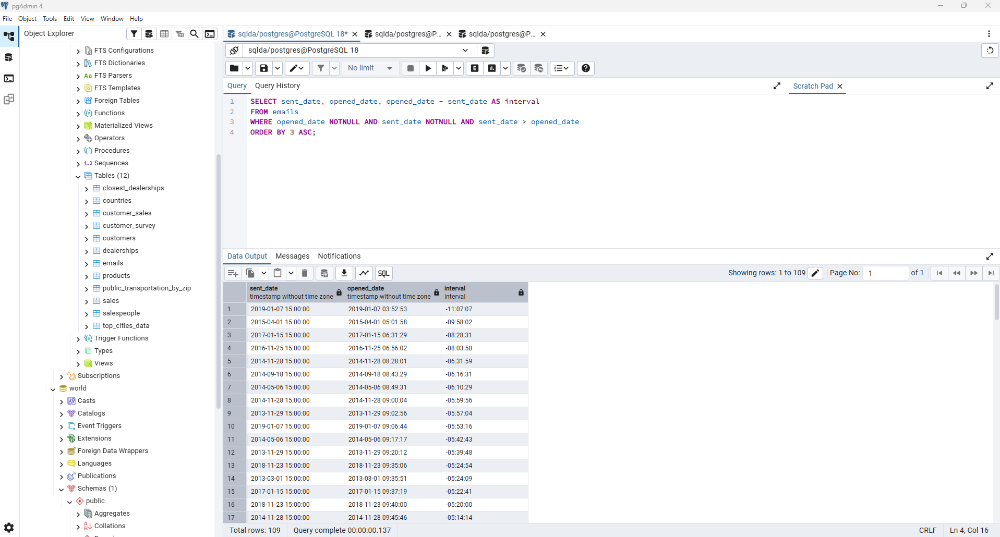
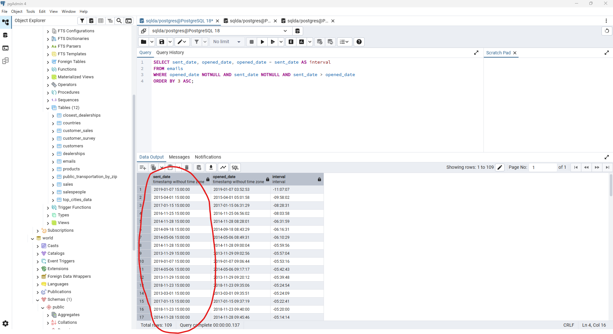
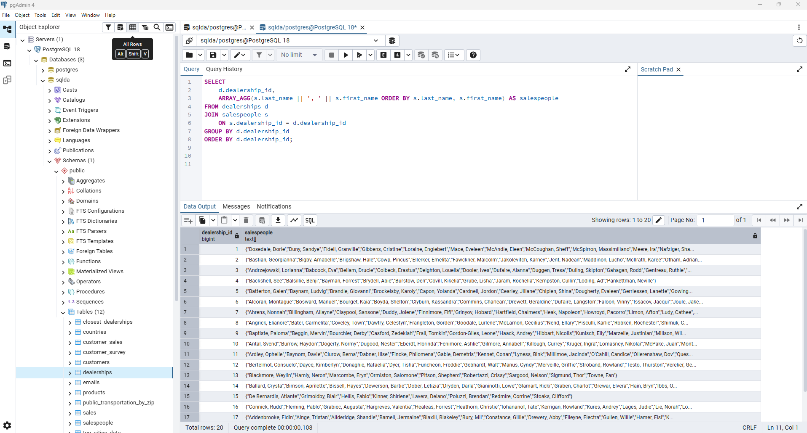
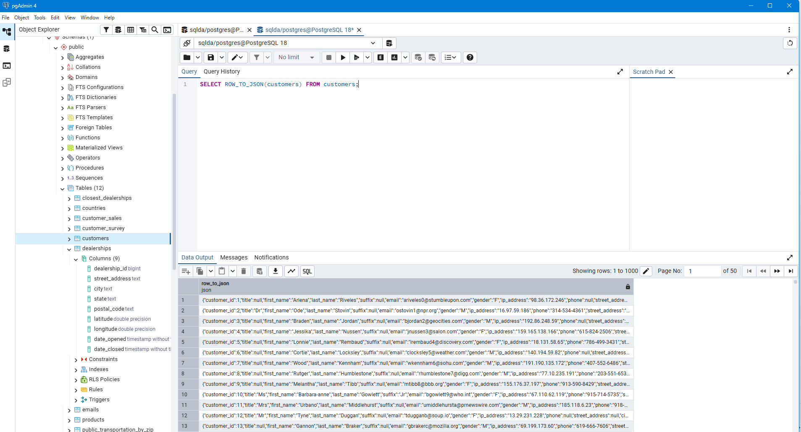
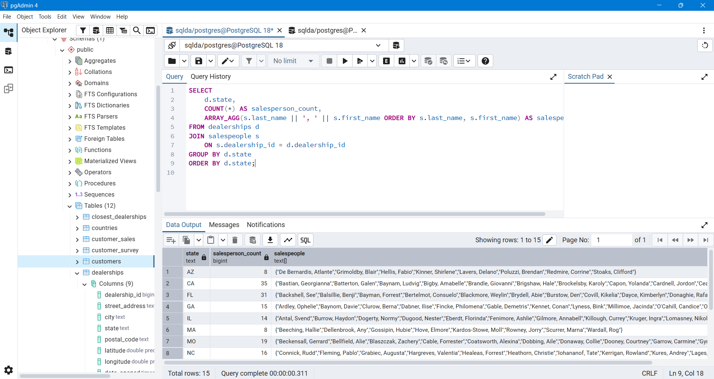

# Exercise 05: SQLDA Database - Dates, Data Quality, Arrays, and JSON

- Name: Branton Dawson
- Course: Database for Analytics
- Module: 5
- Database Used:  `sqlda` (Sample Datasets)
- Tools Used: PostgreSQL (pgAdmin or psql)

---

## Instructions

- Use the **sqlda** database from the "Loading the Sample Datasets" instructions.
- For each SQL task:
  - Include your SQL in a fenced code block
  - Execute it and include a **screenshot** showing the query and results
- Store screenshots in the `screenshots/` folder and embed them below each answer.
- For explanation questions:
  - Write your answer in complete sentences
  - Include a screenshot if requested

---

## Question 1

Using the `sqlda` database, write the SQL needed to show a **list of years** that emails were sent.

Your results should list years like this (order matters):

```
year
2011
2013
2014
2015
2016
2017
2018
2019
```

### SQL

```sql
SELECT DISTINCT EXTRACT(YEAR FROM sent_date) AS year
FROM emails
ORDER BY year ASC;
```

### Screenshot



---

## Question 2

Using the `sqlda` database, write the SQL needed to show the **number of messages sent by year**, ordered by year (as shown in the prompt).

Output should resemble:

```
count   year
...
```

### SQL

```sql
SELECT
  EXTRACT(YEAR FROM sent_date) AS year,
  COUNT(*) AS emails_sent
FROM emails
GROUP BY EXTRACT(YEAR FROM sent_date)
ORDER BY year ASC;
```

### Screenshot



---

## Question 3

Using the `sqlda` database, write the SQL needed to show:
- the **sent date**
- the **opened date**
- the **interval** between the two

Only include emails that contain **both** a sent date and an opened date.

### SQL

```sql
SELECT sent_date, opened_date, opened_date - sent_date AS interval
FROM emails
WHERE opened_date NOTNULL AND sent_date NOTNULL
ORDER BY 3 DESC;
```

### Screenshot



---

## Question 4

Using the `sqlda` database, write the SQL needed to show emails that contain an **opened date BEFORE the sent date**.

### SQL

```sql
SELECT sent_date, opened_date, opened_date - sent_date AS interval
FROM emails
WHERE opened_date NOTNULL AND sent_date NOTNULL AND sent_date > opened_date
ORDER BY 3 ASC;
```

### Screenshot



---

## Question 5

Using the `sqlda` database: there are **over 100 emails** that contain an opened date **BEFORE** the sent date.

After looking at the data, **why is this the case?**

### Answer

_There were 109 that showed opened before the sent data.  It looks like they were all sent at 3:00PM on each day as part of an automated task.  I would attribute this to different time zones._

### Screenshot (if requested by instructor)



---

## Question 6

Using the `sqlda` database, explain in your own words what the following code does:

```sql
CREATE TEMP TABLE customer_points AS (
    SELECT
        customer_id,
        point(longitude, latitude) AS lng_lat_point
    FROM customers
    WHERE longitude IS NOT NULL
    AND latitude IS NOT NULL
);

CREATE TEMP TABLE dealership_points AS (
    SELECT
        dealership_id,
        point(longitude, latitude) AS lng_lat_point
    FROM dealerships
);

CREATE TEMP TABLE customer_dealership_distance AS (
    SELECT
       customer_id,
       dealership_id,
       c.lng_lat_point <@> d.lng_lat_point AS distance
    FROM customer_points c
    CROSS JOIN dealership_points d
);
```

### Answer

_The first two CREATE sections are creating a geospatial location for customers and dealerships.  The third is calculating the distance between customer and dealership._

---

## Question 7

Using the `sqlda` database, write SQL to display an **array of salespeople for each dealership**, sorted by dealership.

For example - dealership 1 is below:

```text
"{""Fidell,Granville"",""Onele,Jereme"",""Sheriff,Lelia"",""McSpirron,Massimiliano"",""Rennick,Nadia"",""Mace,Eveleen"",""Oxteby,Dukie"",""Spong,Marcos"",""Wogden,Quent"",""Duny,Sandye"",""Loraine,Englebert"",""Meere,Ira"",""Gibbens,Cristine"",""Prine,Lyda"",""McCoughan,Sheff"",""Schule,Giselbert"",""McAndie,Eleen"",""Dosedale,Dorie"",""Nafziger,Shay""}"
```

### SQL

```sql
SELECT
    d.dealership_id,
    ARRAY_AGG(s.last_name || ', ' || s.first_name ORDER BY s.last_name, s.first_name) AS salespeople
FROM dealerships d
JOIN salespeople s
    ON s.dealership_id = d.dealership_id
GROUP BY d.dealership_id
ORDER BY d.dealership_id;
```

### Screenshot



---

## Question 8

Using the `sqlda` database, write SQL to display:
- an **array of salespeople for each dealership**
- the **state** of the dealership
- the **number of salespeople** for the dealership

Sort by **state**.

Reference image:


### SQL

```sql
SELECT
    d.state,
	COUNT(*) AS salesperson_count,
    ARRAY_AGG(s.last_name || ', ' || s.first_name ORDER BY s.last_name, s.first_name) AS salespeople
FROM dealerships d
JOIN salespeople s
    ON s.dealership_id = d.dealership_id
GROUP BY d.state
ORDER BY d.state;

```

### Screenshot


---

## Question 9

Using the `sqlda` database, write the SQL needed to convert the **customers** table to **JSON**.

### SQL

```sql
SELECT ROW_TO_JSON(customers) FROM customers;
```

### Screenshot



---

## Question 10

Using the `sqlda` database, write SQL to display:
- an **array of salespeople for each dealership**
- the **state**
- the **number of salespeople**
- sorted by **state**

Then **convert this result to JSON**.

Reference image:


### SQL

```sql
SELECT
    d.state,
	COUNT(*) AS salesperson_count,
    ARRAY_AGG(s.last_name || ', ' || s.first_name ORDER BY s.last_name, s.first_name) AS salespeople
FROM dealerships d
JOIN salespeople s
    ON s.dealership_id = d.dealership_id
GROUP BY d.state
ORDER BY d.state;
```

### Screenshot


