# Module 7 - Final Exercise:

Final Exercise/Final Project - Show Us Your Data!

- Name: Branton Dawson
- Course: Database for Analytics
- Module: 7

---

## Overview

In this exercise you will show us how you created your database, and the steps you went through to get there.

During Module 7, no late work is accepted, regardless of reason.

Instructions:

Complete the instructions in each of the activities below in the following order:

    Module 7: Lecture Materials -- Locating your Data
    Module 7: Lecture Materials -- Installing your Data
    Module 7: Lecture Materials -- Verifying your Data

After completing these activities, show us your end result.  Walk us through what you have and how you got there.

Include the following:

### The initial data source: IMDB Data - IMDb Non-Commercial Datasets

Subsets of IMDb data are available for access to customers for personal and non-commercial use.

- LINK: <https://datasets.imdbws.com/>

### The format of your data, include count of column and rows.

The downloaded format of the data was tab-separated-values (TSV).  There are seven tables described below.

- akas - 8 columns and 55,165,257 rows

- titles - 10 columns and 12,301,237 rows

- crew - 3 columns and 12,301,237 rows

- episode - 4 columns and 9,403,918 rows

- principals - 6 columns and 97,893,697 rows

- ratings - 3 columns and 1,637,877 rows

- names - 6 columns and 15,103,363 rows

### Show a data dictionary - a table describing each data attribute/feature/column.

---
imdb-# \d+ titles
                                              Table "public.titles"
     Column      |  Type   | Collation | Nullable | Default | Storage  | Compression | Stats target | Description
-----------------+---------+-----------+----------+---------+----------+-------------+--------------+-------------
 tconst          | text    |           | not null |         | extended |             |              |
 title_type      | text    |           |          |         | extended |             |              |
 primary_title   | text    |           |          |         | extended |             |              |
 original_title  | text    |           |          |         | extended |             |              |
 is_adult        | integer |           |          |         | plain    |             |              |
 start_year      | integer |           |          |         | plain    |             |              |
 end_year        | integer |           |          |         | plain    |             |              |
 runtime_minutes | integer |           |          |         | plain    |             |              |
 genres          | text    |           |          |         | extended |             |              |
 year_start      | date    |           |          |         | plain    |             |              |
Indexes:
    "title_basics_pkey" PRIMARY KEY, btree (tconst)
    "idx_title_basics_start_year" btree (start_year)
Check constraints:
    "titles_year_valid" CHECK (start_year >= 1 AND start_year <= 9999)
Referenced by:
    TABLE "akas" CONSTRAINT "title_akas_title_id_fkey" FOREIGN KEY (title_id) REFERENCES titles(tconst)
    TABLE "crew" CONSTRAINT "title_crew_tconst_fkey" FOREIGN KEY (tconst) REFERENCES titles(tconst)
    TABLE "episode" CONSTRAINT "title_episode_parent_tconst_fkey" FOREIGN KEY (parent_tconst) REFERENCES titles(tconst)
    TABLE "episode" CONSTRAINT "title_episode_tconst_fkey" FOREIGN KEY (tconst) REFERENCES titles(tconst)
    TABLE "principals" CONSTRAINT "title_principals_tconst_fkey" FOREIGN KEY (tconst) REFERENCES titles(tconst)
    TABLE "ratings" CONSTRAINT "title_ratings_tconst_fkey" FOREIGN KEY (tconst) REFERENCES titles(tconst)
Not-null constraints:
    "title_basics_tconst_not_null" NOT NULL "tconst"
Access method: heap
---

### Describe some of the obstacles you overcame to transform the data.

---

I used the IMDB data and it was in a .tsv format and was challenging to work with.  I could use excel to open five of the seven files and only get a portion of the data from each file that I could open.  I ended up using python and chatgpt to extract and load the data into a usable format.

At least one date data type and the IMDB data did not have that.  I added a new column to the titles table called year_start that was a date data type.  I used January 1 for each start year already in the table.

- SQL CODE:

BEGIN;

-- 1) Add the new date column
ALTER TABLE titles
ADD COLUMN year_start date;

-- 2) Populate it with Jan 1 of that year
UPDATE titles
SET year_start = make_date(start_year, 1, 1)
WHERE start_year IS NOT NULL
  AND start_year BETWEEN 1 AND 9999;

-- (Optional) Enforce valid year range going forward
ALTER TABLE titles
ADD CONSTRAINT titles_year_valid CHECK (start_year BETWEEN 1 AND 9999);

COMMIT;

---

### Show your table structure including data types.

---

akas - 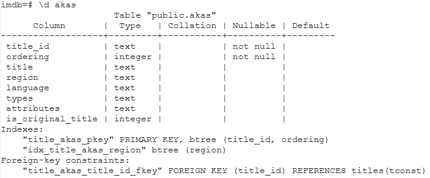

    <PRIMARY KEY> titleId (string) - a tconst, an alphanumeric unique identifier of the title
    <PRIMARY KEY> ordering (integer) – a number to uniquely identify rows for a given titleId
    title (string) – the localized title
    region (string) - the region for this version of the title
    language (string) - the language of the title
    types (array) - Enumerated set of attributes for this alternative title. One or more of the following: "alternative", "dvd", "festival", "tv", "video", "working", "original", "imdbDisplay". New values may be added in the future without warning
    attributes (array) - Additional terms to describe this alternative title, not enumerated
    isOriginalTitle (boolean) – 0: not original title; 1: original title

titles - 

    <PRIMARY KEY> tconst (string) - alphanumeric unique identifier of the title
    titleType (string) – the type/format of the title (e.g. movie, short, tvseries, tvepisode, video, etc)
    primaryTitle (string) – the more popular title / the title used by the filmmakers on promotional materials at the point of release
    originalTitle (string) - original title, in the original language
    isAdult (boolean) - 0: non-adult title; 1: adult title
    startYear (YYYY) – represents the release year of a title. In the case of TV Series, it is the series start year
    endYear (YYYY) – TV Series end year. '\N' for all other title types
    runtimeMinutes – primary runtime of the title, in minutes
    genres (string array) – includes up to three genres associated with the title
    year_start (date) - added this field to the title data for a field that was type date

crew - 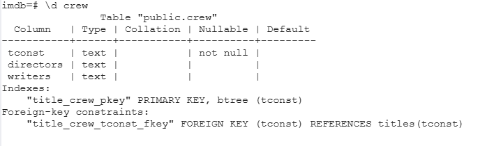

    <PRIMARY KEY> tconst (string) - alphanumeric unique identifier of the title
    directors (array of nconsts) - director(s) of the given title
    writers (array of nconsts) – writer(s) of the given title

episode - 

    <PRIMARY KEY> tconst (string) - alphanumeric identifier of episode
    parentTconst (string) - alphanumeric identifier of the parent TV Series
    seasonNumber (integer) – season number the episode belongs to
    episodeNumber (integer) – episode number of the tconst in the TV series

principals - 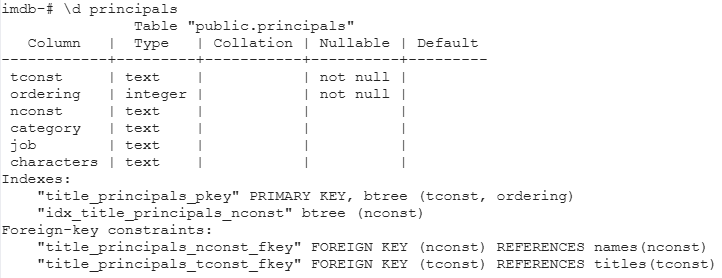

    <PRIMARY KEY> tconst (string) - alphanumeric unique identifier of the title
    <PRIMARY KEY> ordering (integer) – a number to uniquely identify rows for a given titleId
    nconst (string) - alphanumeric unique identifier of the name/person
    category (string) - the category of job that person was in
    job (string) - the specific job title if applicable, else '\N'
    characters (string) - the name of the character played if applicable, else '\N'

ratings - 

    <PRIMARY KEY> tconst (string) - alphanumeric unique identifier of the title
    averageRating – weighted average of all the individual user ratings
    numVotes - number of votes the title has received

names - 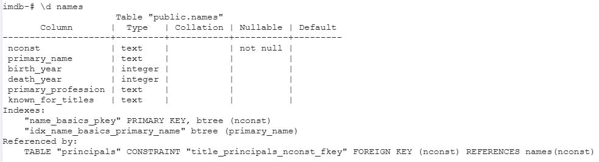

    <PRIMARY KEY> nconst (string) - alphanumeric unique identifier of the name/person
    primaryName (string)– name by which the person is most often credited
    birthYear – in YYYY format
    deathYear – in YYYY format if applicable, else '\N'
    primaryProfession (array of strings)– the top-3 professions of the person
    knownForTitles (array of tconsts) – titles the person is known for

---

### Select * from each of your tables

- akas - 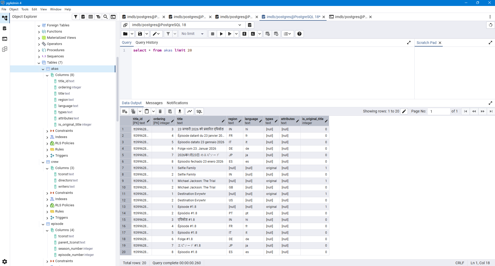

- titles - 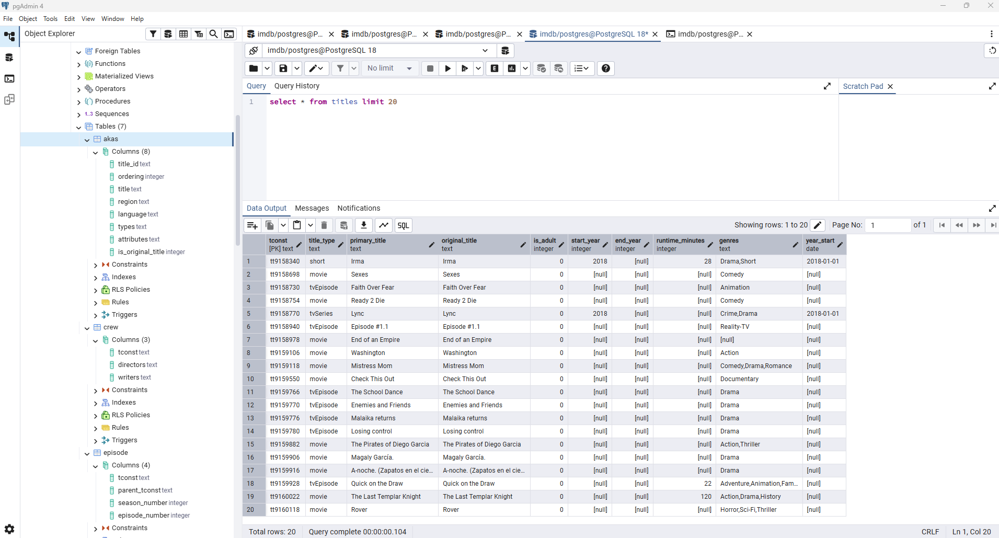

- crew - 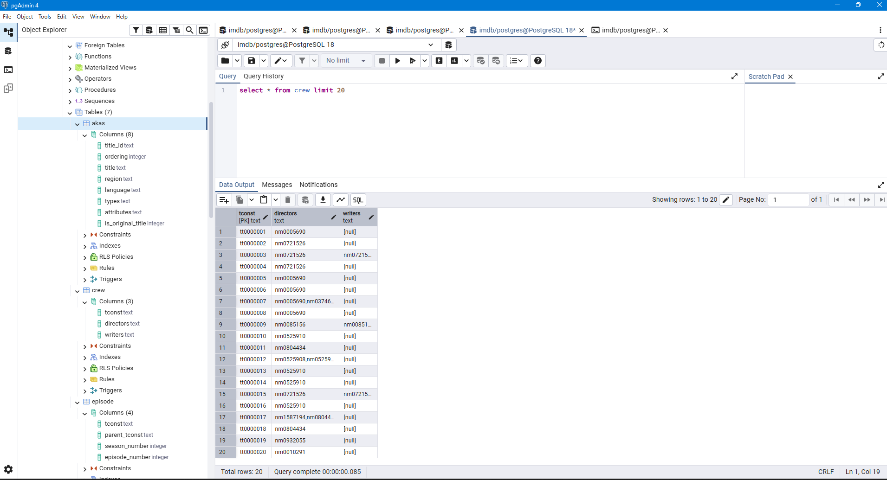

- episode - 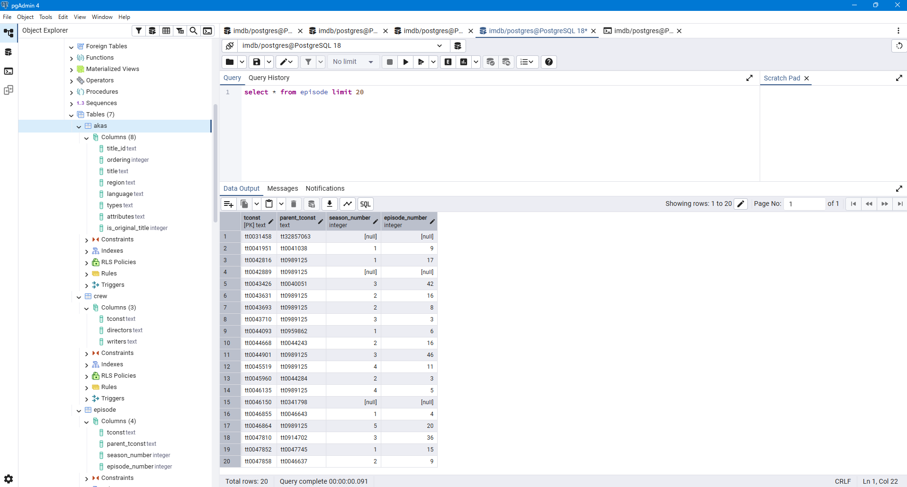

- principals - 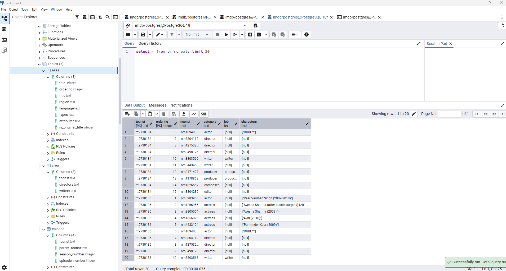

- ratings - 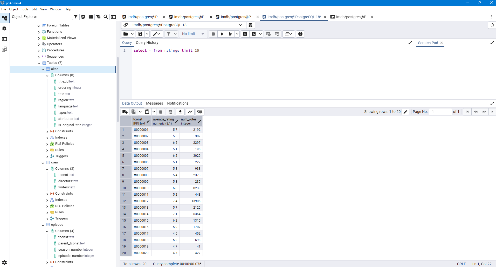

- names - 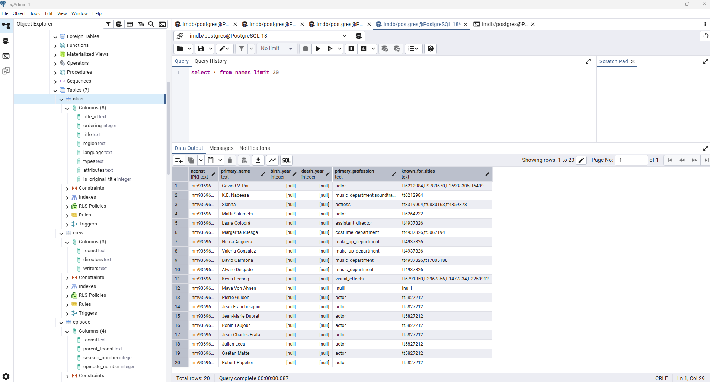

### Show some **interesting queries** from your tables.  

- Include:
- At least one join
- At least one query where you group by and aggregate data

**JOIN** - Top 20 movies of all time.  (Shawshank Redemption is one of my top 3 favorites!!!)
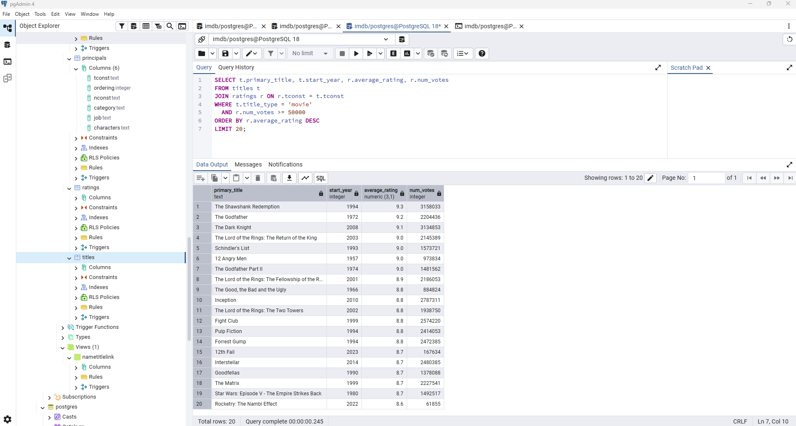

---

SELECT t.primary_title, t.start_year, r.average_rating, r.num_votes
FROM titles t
JOIN ratings r ON r.tconst = t.tconst
WHERE t.title_type = 'movie'
  AND r.num_votes >= 50000
ORDER BY r.average_rating DESC
LIMIT 20;

---

**GROUP BY**
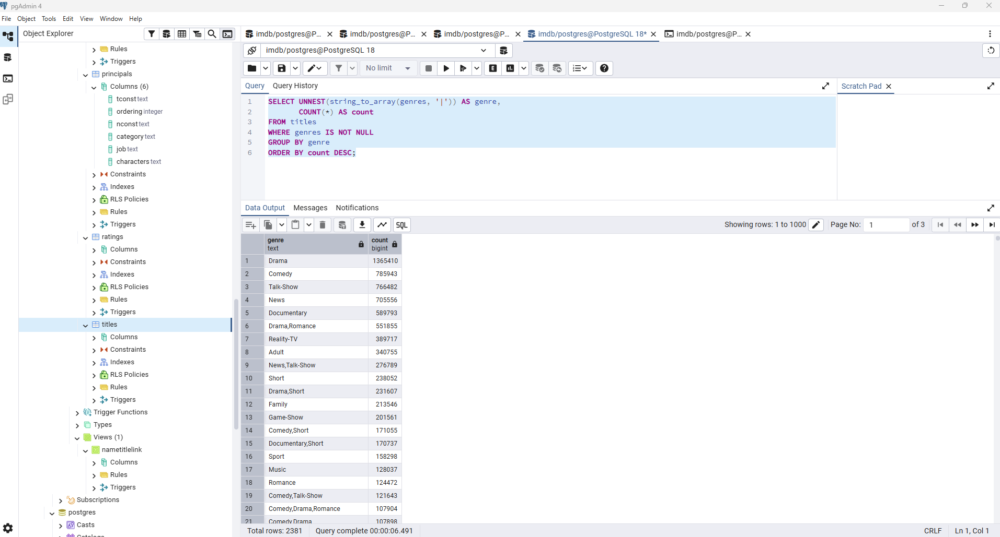

---

SELECT UNNEST(string_to_array(genres, '|')) AS genre,
       COUNT(*) AS count
FROM titles
WHERE genres IS NOT NULL
GROUP BY genre
ORDER BY count DESC;

---

**AGGREGATE DATA**
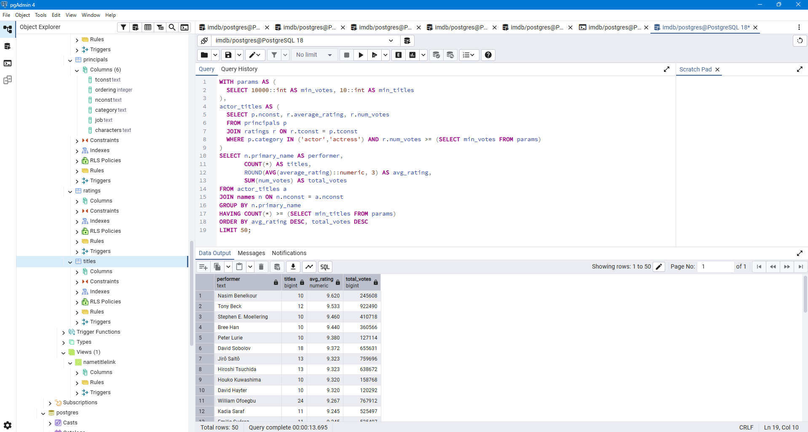

---

WITH params AS (
  SELECT 10000::int AS min_votes, 10::int AS min_titles
),
actor_titles AS (
  SELECT p.nconst, r.average_rating, r.num_votes
  FROM principals p
  JOIN ratings r ON r.tconst = p.tconst
  WHERE p.category IN ('actor','actress') AND r.num_votes >= (SELECT min_votes FROM params)
)
SELECT n.primary_name AS performer,
       COUNT(*) AS titles,
       ROUND(AVG(average_rating)::numeric, 3) AS avg_rating,
       SUM(num_votes) AS total_votes
FROM actor_titles a
JOIN names n ON n.nconst = a.nconst
GROUP BY n.primary_name
HAVING COUNT(*) >= (SELECT min_titles FROM params)
ORDER BY avg_rating DESC, total_votes DESC
LIMIT 50;

---
